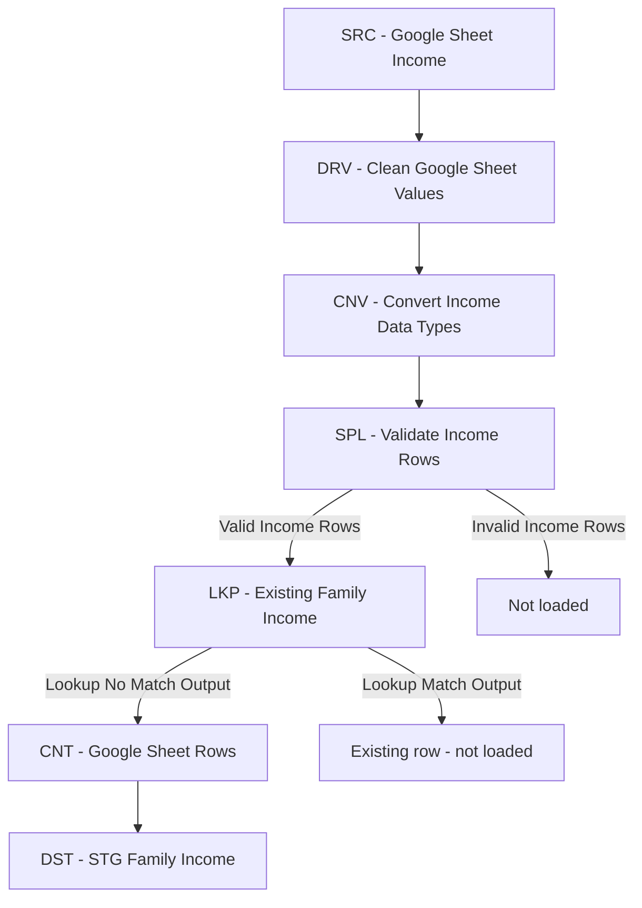

# Income Load from Google Sheets

## Project information

| Item | Value |
|---|---|
| Project | `DW_FamilyFinance` |
| SSIS project | `ETL_FamilyFinance` |
| Package | `IncomeLoad_GoogleSheet.dtsx` |
| Source | Private Google Sheet |
| Source worksheet | `Data` |
| Target database | `STG_FamilyLiving` |
| Target table | `dbo.Family_Income` |
| Load type | Incremental insert |
| Author | Behailu Tessema |
| Initial version | 1.0 |
| Created | 2026-09-03 |

## Purpose

`IncomeLoad_GoogleSheet.dtsx` securely reads family payroll data from a private Google Sheet, cleans and converts the source values, validates each row, prevents duplicate paycheck records, and inserts only new records into `STG_FamilyLiving.dbo.Family_Income`.

The package replaces the retired `STG_LoadIncomeData.dtsx` package. Both `STG_Master_FullLoad.dtsx` and `STG_Master_Incremental.dtsx` execute this package.

## Data-flow design



Only the Lookup **No Match Output** is connected to the destination. A matched row already exists in SQL Server and must not be inserted again.

## Prerequisites

- SQL Server Integration Services project in Visual Studio/SSDT.
- Google Cloud project with the **Google Sheets API** enabled.
- Google service account with a downloaded JSON key.
- Source spreadsheet shared with the service-account email as **Viewer**.
- `System.Web.Extensions` reference added to the VSTA Script Component project.
- SQL Server connection manager named `OLEDB_STG` with access to `STG_FamilyLiving`.
- Lookup view `dbo.vw_FamilyIncome_ExistingKeys` created in `STG_FamilyLiving`.

## Google Cloud and spreadsheet setup

1. Create or select a Google Cloud project.
2. Enable **Google Sheets API** for the project.
3. Create a service account.
4. Create and download a JSON key for that service account.
5. Store the JSON file in a protected local directory outside the Git repository.
6. Open the source Google Sheet and share it with the service-account email.
7. Grant the service account **Viewer** permission only.

The Script Component uses this read-only OAuth scope:

```text
https://www.googleapis.com/auth/spreadsheets.readonly
```

The package reads the spreadsheet but does not add, edit, or delete Google Sheet data.

## Security requirements

Never commit any of the following to Git:

- Service-account JSON key
- Private key
- Access token
- Production spreadsheet ID, when the repository is public
- Local credential path containing sensitive information

Recommended `.gitignore` entries:

```gitignore
# Google service-account credentials
*.json
Credentials/
secrets/
```

Use SSIS project parameters, environment variables, or SSIS Catalog environments for deployment-specific values. Restrict the JSON file so only the SQL Server Agent or package-execution account can read it.

## SSIS variables

| Variable | Type | Example or purpose |
|---|---|---|
| `GoogleCredentialsPath` | String | Protected path such as `C:\\SSIS\\Credentials\\google-sheets-key.json` |
| `GoogleSpreadsheetId` | String | Spreadsheet ID supplied through configuration; do not document the production value in a public repository |
| `GoogleSheetRange` | String | `Data!A2:O` |
| `GoogleRowsRead` | Int32 | Counts new rows sent from the Lookup No Match Output toward the destination |

`Data!A2:O` begins on row 2 to exclude the header. The open-ended row number allows the package to read current and future records while limiting the source to columns A through O.

## Expected source columns

The `Data` worksheet must preserve this column order:

| Position | Google Sheet field | SSIS output column |
|---:|---|---|
| A | `Submitted_At` | `Submitted_At` |
| B | `Period_Start` | `Period_Start` |
| C | `Period_End` | `Period_End` |
| D | `Pay_Day` | `Pay_Day` |
| E | `Work_Place` | `Work_Place` |
| F | `Employee_FullName` | `Employee_FullName` |
| G | `Gross_Payment` | `Gross_Payment` |
| H | `Federal_Income_Tax` | `Federal_Income_Tax` |
| I | `Social_Security` | `Social_Security` |
| J | `Medicare` | `Medicare` |
| K | `CA_State_Tax` | `CA_State_Tax` |
| L | `CA-Disablity` | `CA_Disability` |
| M | `Net_Income` | `Net_Income` |
| N | `Total_Tax` | `Total_Tax` |
| O | `Data_Validetor` | `Data_Validator` |

The Script Component maps values by column position and standardizes the two misspelled source headers in the SSIS output. Changing the worksheet column order requires a corresponding Script Component update.

## Script Component configuration

### Component

- Name: `SRC - Google Sheet Income`
- Type: Source
- Script language: Microsoft Visual C#
- VSTA version: C# 2022
- Entry method: `CreateNewOutputRows()`

### Read-only variables

```text
User::GoogleCredentialsPath
User::GoogleSpreadsheetId
User::GoogleSheetRange
```

### Output metadata

The output is named `GoogleSheetOutput`. Its 15 columns are initially defined as Unicode strings (`DT_WSTR`) with length 255. Keeping the API output as strings allows the downstream transformations to clean currency formatting and perform explicit type conversion.

### Authentication process

The source component:

1. Reads `client_email`, `private_key`, and `token_uri` from the service-account JSON file.
2. Creates and signs a JWT assertion.
3. Exchanges the assertion for a temporary OAuth access token.
4. Sends an authenticated HTTP `GET` request to the Google Sheets API.
5. Deserializes the returned `values` array and creates one SSIS output row for each nonblank source row.

## Transformation rules

### 1. Clean Google Sheet values

`DRV - Clean Google Sheet Values` creates clean string columns for all monetary fields. Each expression trims whitespace, substitutes `0` for a blank value, and removes dollar signs and commas.

Example:

```text
LEN(TRIM([Gross_Payment])) == 0
? "0"
: REPLACE(REPLACE(TRIM([Gross_Payment]),"$",""),",","")
```

Clean output columns:

- `Gross_Payment_Clean`
- `Federal_Income_Tax_Clean`
- `Social_Security_Clean`
- `Medicare_Clean`
- `CA_State_Tax_Clean`
- `CA_Disability_Clean`
- `Net_Income_Clean`
- `Total_Tax_Clean`

### 2. Convert data types

`CNV - Convert Income Data Types` creates strongly typed outputs:

| Input | Converted output | SSIS data type |
|---|---|---|
| `Submitted_At` | `Submitted_At_DateTime` | `DT_DBTIMESTAMP` |
| `Period_Start` | `Period_Start_Date` | `DT_DBDATE` |
| `Period_End` | `Period_End_Date` | `DT_DBDATE` |
| `Pay_Day` | `Pay_Day_Date` | `DT_DBDATE` |
| `Gross_Payment_Clean` | `Gross_Payment_Decimal` | `DT_NUMERIC(18,2)` |
| `Federal_Income_Tax_Clean` | `Federal_Income_Tax_Decimal` | `DT_NUMERIC(18,2)` |
| `Social_Security_Clean` | `Social_Security_Decimal` | `DT_NUMERIC(18,2)` |
| `Medicare_Clean` | `Medicare_Decimal` | `DT_NUMERIC(18,2)` |
| `CA_State_Tax_Clean` | `CA_State_Tax_Decimal` | `DT_NUMERIC(18,2)` |
| `CA_Disability_Clean` | `CA_Disability_Decimal` | `DT_NUMERIC(18,2)` |
| `Net_Income_Clean` | `Net_Income_Decimal` | `DT_NUMERIC(18,2)` |
| `Total_Tax_Clean` | `Total_Tax_Decimal` | `DT_NUMERIC(18,2)` |
| `Data_Validator` | `Data_Validator_Integer` | `DT_I4` |

`Submitted_At_DateTime` is retained as source audit metadata but is not loaded because the current destination table has no matching column.

### 3. Validate rows

`SPL - Validate Income Rows` uses this condition:

```text
[Data_Validator_Integer] == 1
```

- `Valid Income Rows`: sent to the incremental Lookup.
- `Invalid Income Rows`: not sent to the destination.

### 4. Prevent duplicate inserts

`LKP - Existing Family Income` reads existing paycheck keys from `dbo.vw_FamilyIncome_ExistingKeys` using `OLEDB_STG`.

Lookup configuration:

| Setting | Value |
|---|---|
| Cache mode | Full cache |
| Connection type | OLE DB connection manager |
| No-match behavior | Redirect rows to no match output |
| Reference object | `dbo.vw_FamilyIncome_ExistingKeys` |

The paycheck business key consists of:

| SSIS input | Lookup-view column |
|---|---|
| `Period_Start_Date` | `Period_Bginning` |
| `Period_End_Date` | `Period_Ending` |
| `Pay_Day_Date` | `Pay_Day` |
| `Work_Place` | `Work_Place` |
| `Employee_FullName` | `Employee_FullName` |

The Lookup reference-column checkboxes remain unchecked because the package uses the view only to determine whether a matching row exists.

## Destination mappings

`DST - STG Family Income` uses `OLEDB_STG` and inserts into `dbo.Family_Income`.

| SSIS input | Destination column |
|---|---|
| Ignore | `IncomeSourceID` — identity column |
| `Period_Start_Date` | `Period_Bginning` |
| `Period_End_Date` | `Period_Ending` |
| `Pay_Day_Date` | `Pay_Day` |
| `Work_Place` | `Work_Place` |
| `Employee_FullName` | `Employee_FullName` |
| `Gross_Payment_Decimal` | `Gross_Payment` |
| `Federal_Income_Tax_Decimal` | `Federal_Tax` |
| `Social_Security_Decimal` | `SS_Tax` |
| `Medicare_Decimal` | `Medical_Tax` |
| `CA_State_Tax_Decimal` | `CA_State_Tax` |
| `CA_Disability_Decimal` | `CA_SDI_Tax` |
| `Net_Income_Decimal` | `Employer_NetPay` |
| `Total_Tax_Decimal` | `Total_Tax` |
| `Data_Validator_Integer` | `Payment_Validation` |

## Incremental-load behavior

| Test | Expected result |
|---|---|
| Initial execution against an empty destination | All valid source rows are inserted |
| Repeat execution with no Google Sheet changes | Destination writes 0 rows |
| Add one valid new paycheck and execute again | Exactly one row is inserted |
| Source row matches an existing five-column business key | Row is treated as a Lookup match and is not inserted |
| `Data_Validator` is not 1 | Row is routed to the invalid output and is not inserted |

## Validation queries

```sql
USE STG_FamilyLiving;
GO

-- Purpose: Display the most recently inserted family-income records after an SSIS test.
SELECT TOP (100)
    IncomeSourceID,
    Period_Bginning,
    Period_Ending,
    Pay_Day,
    Work_Place,
    Employee_FullName,
    Gross_Payment,
    Employer_NetPay,
    Payment_Validation
FROM dbo.Family_Income
ORDER BY IncomeSourceID DESC;
GO

-- Purpose: Confirm the current number of rows in the family-income staging table.
SELECT COUNT(*) AS FamilyIncomeRowCount
FROM dbo.Family_Income;
GO

-- Purpose: Identify duplicate paycheck business keys that existed before incremental loading was enabled.
SELECT
    Period_Bginning,
    Period_Ending,
    Pay_Day,
    Work_Place,
    Employee_FullName,
    COUNT(*) AS DuplicateCount
FROM dbo.Family_Income
GROUP BY
    Period_Bginning,
    Period_Ending,
    Pay_Day,
    Work_Place,
    Employee_FullName
HAVING COUNT(*) > 1
ORDER BY DuplicateCount DESC;
GO

-- Purpose: Verify the distinct business keys exposed to the SSIS Lookup transformation.
SELECT
    Period_Bginning,
    Period_Ending,
    Pay_Day,
    Work_Place,
    Employee_FullName
FROM dbo.vw_FamilyIncome_ExistingKeys
ORDER BY Pay_Day DESC, Employee_FullName;
GO
```

## Testing procedure

1. Confirm the credential file exists and the executing account can read it.
2. Confirm the service-account email still has Viewer access to the spreadsheet.
3. Execute `IncomeLoad_GoogleSheet.dtsx` directly.
4. Review the SSIS Progress/Execution Results output.
5. Confirm the destination row count and inspect the latest rows with the validation queries.
6. Execute the package again without changing the Google Sheet.
7. Confirm the message reports that `DST - STG Family Income` wrote 0 rows.
8. Add one valid test paycheck to the Google Sheet and execute again.
9. Confirm exactly one new SQL row is inserted.

## Troubleshooting

| Symptom | Likely cause | Resolution |
|---|---|---|
| Package succeeds but writes 0 rows on the first load | API returned no rows, validation rejected all rows, or range is incorrect | Check the `Rows received from Google Sheets` message, `GoogleSheetRange`, and `Data_Validator` values |
| Repeat execution inserts duplicates | Destination is connected to Lookup Match Output or Lookup keys are incomplete | Connect only **Lookup No Match Output** and verify all five key relationships |
| Lookup editor reports no relationship | Input and lookup columns are not mapped | Map the five business-key columns on the Lookup Columns page |
| Google API returns 403 | Sheets API is disabled or the spreadsheet is not shared with the service account | Enable the API and grant the service account Viewer access |
| Credential file not found | `GoogleCredentialsPath` is incorrect or unavailable to the execution account | Correct the configured path and file permissions |
| Authentication fails | JSON key is invalid, revoked, or malformed | Create a new service-account key and update the protected credential file |
| Date or numeric conversion fails | Source contains an unexpected format | Inspect the source row and standardize its dates or monetary values |
| Performance-counter shared-memory warning | Visual Studio is not elevated | The warning does not prevent loading; run as administrator only when performance counters are required |
| `Submitted_At_DateTime` unused warning | Destination has no submission-timestamp column | Safe to ignore unless a destination audit column is added |

## Deployment checklist

- [ ] Google Sheets API enabled.
- [ ] Service account active.
- [ ] Spreadsheet shared with service account as Viewer.
- [ ] JSON key stored outside Git.
- [ ] Execution account granted read access to the JSON file.
- [ ] SSIS variables or parameters configured for the environment.
- [ ] `OLEDB_STG` points to the correct SQL Server environment.
- [ ] `dbo.vw_FamilyIncome_ExistingKeys` deployed.
- [ ] Destination mappings validated.
- [ ] Lookup No Match Output connected to the destination path.
- [ ] Direct package test completed.
- [ ] Repeat-execution test writes 0 duplicate rows.
- [ ] Master Full Load and Incremental Load packages tested.

## Related project artifacts

- `IncomeLoad_GoogleSheet.dtsx`
- `STG_Master_FullLoad.dtsx`
- `STG_Master_Incremental.dtsx`
- `dbo.vw_FamilyIncome_ExistingKeys.sql`
- `GoogleSheets_ScriptComponent_main.cs`

## Change history

| Version | Date | Author | Description |
|---|---|---|---|
| 1.0 | 2026-09-03 | Behailu Tessema | Created the private Google Sheets source, cleaning, conversion, validation, and SQL destination flow |
| 1.1 | 2026-09-03 | Behailu Tessema | Added incremental Lookup using `dbo.vw_FamilyIncome_ExistingKeys` and retired `STG_LoadIncomeData.dtsx` |

